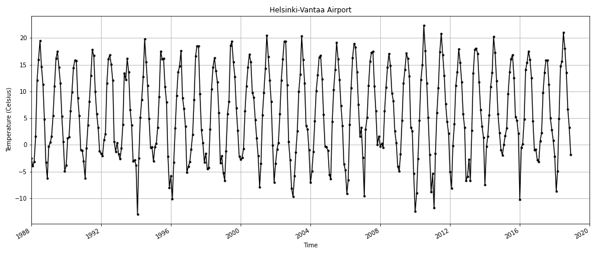

## Problem 2 - Plotting temperatures

In this problem we will  plot monthly mean temperatures from the Helsinki-Vantaa airpot for the past 30 years.

The final output should look like this:


## Input data

File `data/helsinki-vantaa.csv` monthly average temperatures from Helsinki Vantaa airport. Column descriptions:

- `DATE`: YEAR-MONTH-DAY (the time stamp contains the first day of each month, but values in other columns are average values for the whole month!)
- `USAF`: Station number
- `TEMP_F`: Monthly mean temperature in Fahrenheit 
- `TEMP_C`: Monthly mean temperature in Celsius
- `REF_TEMP_C`: Long term average in Celsius (for the period 1988-2018)
- `DIFF_C`: Difference between monthly mean and long term average in Celsius


### Part 1

Load the Helsinki temperature data (`data/helsinki-vantaa.csv`)

- Read the data into variable called `data` using pandas
- Parse dates from the column `'DATE'` and set the dates as index in the dataframe 


```python
#  YOUR CODE HERE 1 to read the data into data and parse dates from the column 'DATE'
import pandas as pd
fp="data/helsinki-vantaa.csv"
data=pd.read_csv(fp,parse_dates=['DATE'],index_col='DATE')
```


```python
# This test print should print first five rows
print(data.head())
```


```python
# Check the number of rows in the data frame
print(len(data))
```

### Part 2

Select data for a 30 year period (January 1988 - December 2018)

- Store the selection in a new variable `selection`


```python
# YOUR CODE HERE 2
selection=data.loc[(data.index>='1988-01-01')&(data.index<'2018-12-31')]
```


```python
# Check that the data was read in correctly:
selection.head()
```


```python
# Check how many rows of data you selected:
print("Number of rows:", len(selection))
```

### Part 3

#### Part 3.1

Create a line plot that displays the temperatures (`TEMP_C`) for yeach month in the 30 year time period:
     
- Adjust line style:
    - solid line 
    - black color
    - round markers
     
- Add title and axis labels:
    - title: `"Helsinki-Vantaa Airport"` 
    - X-label should be `"Time"`
    - Y-label should be `"Temperature (Celsius)"`

#### Part 3.2

Save your figure as PNG file called `temp_line_plot.png`.

**HINTS:**
- Control the figure size:
    - Create a figure object and use the `figsize` parameter. 
    - The example figure uses `figsize=(14,6)` (you can experiment also with other figure sizes!)
- You can control the marker size using parameter `markersize` when plotting. The example plot uses markersize 3.
- You can add the grid lines using: `plt.grid()`.


```python
# YOUR CODE HERE 3 
import matplotlib.pyplot as plt
selection=selection.sort_index()
plt.plot(selection.index,selection['TEMP_C'],linestyle='solid',c='black',marker='o',markersize=3)
plt.title("Helsinki-Vantaa Airport")
plt.xlabel("Time")
plt.ylabel("Temperature(Celsius)")
plt.grid()
plt.show()


# Set output file name
outputfp = "temp_line_plot.png"

# Save plot as image
# YOUR CODE HERE 4 
plt.savefig(outputfp)
```


```python
import os

#Check that output file exists (also open the file and check that the plot looks ok!)
os.path.exists(outputfp)
```

### Done!
